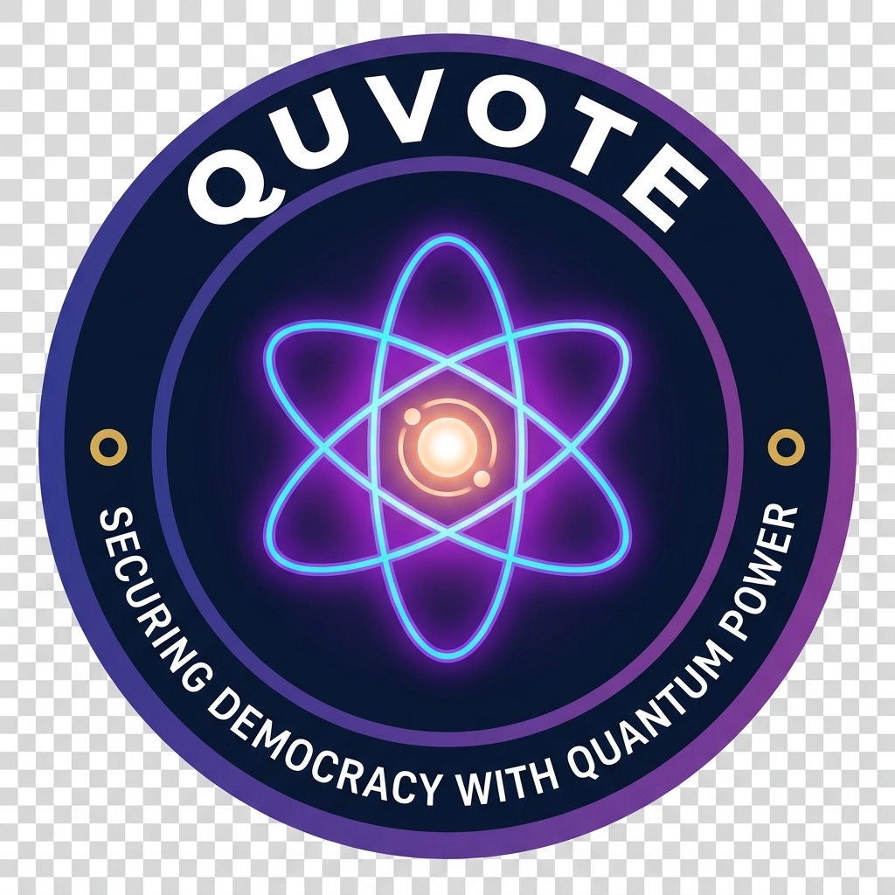

# ⚛️ QuVote — Quantum-Secured Digital Voting Platform

<p align="center">
  
</p>

<p align="center">
  <b>Your vote is your voice. Cast it with confidence.</b><br>
  Every ballot is biometrically verified, quantum-encrypted, and permanently secured.<br>
  <i>Democracy, reimagined for the digital age.</i>
</p>

<p align="center">
  
  
  
  
</p>

---

## 🌐 Live Demo

> Deployed at: **[https://quantum-voting.onrender.com](https://quantum-voting.onrender.com)**

---

## 📋 Table of Contents

- [About](#about)
- [Features](#features)
- [Tech Stack](#tech-stack)
- [Project Structure](#project-structure)
- [Getting Started](#getting-started)
- [Environment Variables](#environment-variables)
- [How It Works](#how-it-works)
- [Screenshots](#screenshots)
- [Team](#team)

---

## 📖 About

**QuVote** is a next-generation electronic voting platform designed to make elections tamper-proof, transparent, and accessible. It combines:

- 🔐 **Biometric Face Verification** — Every voter is face-scanned during registration. The scan is stored as an encrypted base64 encoding and compared on login.
- ⚛️ **Quantum Random OTP** — One-time passwords are generated using the ANU Quantum Random Number Generator API, making them truly unpredictable.
- 🧠 **AI Voter Education** — A multilingual chatbot powered by Groq LLaMA answers any question about the election in any language.
- 🗄️ **MongoDB Atlas** — All voter, candidate, and vote data is stored in a cloud database with full audit trails.
- 📧 **Email Notifications** — Voters receive OTPs, approval/rejection notices, and election results via SendGrid email.

---

## ✨ Features

### 🗳️ Voter Features
| Feature | Description |
|---|---|
| **Voter Registration** | Submit Voter ID, name, email, password, and face scan for admin approval |
| **OTP Login** | Secure login via quantum-generated 6-digit one-time password sent to email |
| **Cast Vote** | Choose a candidate from the official ballot and submit a single secure vote |
| **Vote Receipt** | Receive a unique SHA-256 encrypted receipt after voting for verification |
| **Voter Dashboard** | View your registration status, voting history, and candidate information |
| **Submit a Query** | Send questions directly to the election admin team |
| **Election Countdown** | Live countdown clock showing time remaining to vote |

### 🛡️ Admin Features
| Feature | Description |
|---|---|
| **Admin Registration** | Secure onboarding with a secret admin key issued by the system owner |
| **Admin Login** | Password-protected access to the election dashboard |
| **Manage Candidates** | Add or remove candidates with name, party, and symbol |
| **Voter Roll Management** | Add or remove eligible voters from the official register |
| **Pending Approval Queue** | Review and approve or reject new voter registrations |
| **Live Results Chart** | Real-time animated bar chart of votes per candidate |
| **Voter Turnout Chart** | Donut chart visualizing eligible vs voted vs pending counts |
| **PDF Results Report** | Download official election results as a formatted PDF |
| **Set Election End Time** | Configure the poll closing time with date/time picker |
| **Winner Announcement** | Auto-emails all voters with results when polls close |
| **Suspicious Activity Alerts** | Flags voters sharing the same IP address |
| **Query Management** | Read and reply to voter-submitted questions |

### 🤖 AI Education Bot
| Feature | Description |
|---|---|
| **Multilingual Support** | Understands and responds in any language |
| **Voter Education** | Answers questions about the voting process, candidates, and eligibility |
| **Streaming Responses** | Real-time word-by-word streaming responses |
| **Conversation History** | Maintains full session chat history |

---

## 🛠️ Tech Stack

| Layer | Technology |
|---|---|
| **Frontend / UI** | Streamlit 1.x with custom CSS (glassmorphism, dark mode) |
| **Backend Logic** | Python 3.11+ |
| **Database** | MongoDB Atlas (PyMongo) |
| **Face Recognition** | OpenCV (cv2) — histogram comparison |
| **OTP Generation** | ANU Quantum RNG API + Python `secrets` fallback |
| **Email Service** | SendGrid API |
| **AI Chatbot** | Groq API — LLaMA 3.3-70B Versatile |
| **Charts** | Plotly |
| **PDF Generation** | fpdf2 |
| **Deployment** | Render (cloud) |
| **Version Control** | GitHub |

---

## 📁 Project Structure

```
QuVote/
├── app.py              # Main application (UI + routing + all pages)
├── database.py         # MongoDB database layer (all collections + queries)
├── requirements.txt    # Python dependencies
├── logo.png            # QuVote round badge logo
├── .env                # Environment variables (NOT committed to git)
├── .gitignore          # Ignores .env and other sensitive files
└── README.md           # This file
```

---

## 🚀 Getting Started

### Prerequisites
- Python 3.11+
- MongoDB Atlas account (free tier works)
- SendGrid account (free tier works)
- Groq API key (free at console.groq.com)

### Local Setup

```bash
# 1. Clone the repository
git clone https://github.com/Lohin0105/Quantum-Voting.git
cd Quantum-Voting

# 2. Create a virtual environment
python -m venv .venv
.venv\Scripts\activate        # Windows
# source .venv/bin/activate   # macOS/Linux

# 3. Install dependencies
python -m pip install -r requirements.txt

# 4. Create your .env file (see Environment Variables section)

# 5. Run the application
python -m streamlit run app.py
```

The app will open at **http://localhost:8501**

---

## 🔐 Environment Variables

Create a `.env` file in the root directory with the following keys:

```env
# MongoDB Atlas connection string
MONGO_URI=mongodb+srv://<username>:<password>@<cluster>.mongodb.net/?appName=<app>

# SendGrid email service
SENDGRID_API_KEY=SG.xxxxxxxxxxxxxxxxxxxxxxxxxxxxxxxx
SENDGRID_FROM_EMAIL=youremail@example.com

# Groq AI API key (get free at console.groq.com)
GROK_API_KEY=gsk_xxxxxxxxxxxxxxxxxxxxxxxxxxxxxxxx
```

> ⚠️ **Never commit your `.env` file to Git.** It is already listed in `.gitignore`.

---

## ⚙️ How It Works

### Voter Registration Flow
```
Voter fills form (Voter ID, Name, Email, Password, Face Scan)
        ↓
Details saved to pending_users collection
        ↓
Admin reviews in the Pending Approval Queue
        ↓
Admin Approves → user moves to users collection → approval email sent
Admin Rejects  → document deleted → rejection email sent
        ↓
Voter can now login
```

### Login Flow
```
Voter enters Voter ID + Email
        ↓
System verifies voter exists and is approved
        ↓
Quantum OTP generated and emailed
        ↓
Voter enters OTP (valid for 5 minutes)
        ↓
OTP verified → voter is logged in → redirected to voting page
```

### Voting Flow
```
Voter selects candidate from official ballot
        ↓
Vote saved to votes collection in MongoDB
        ↓
valid_voters document updated: voted = True
        ↓
Unique SHA-256 vote receipt generated and displayed
        ↓
Voter cannot vote again (system checks voted flag)
```

### Election End Flow
```
Admin sets election_end_time in Admin Dashboard
        ↓
App checks on every page load: now > election_end_time?
        ↓
If yes and winner_announced == False:
   → Calculate winner from vote counts
   → Send email to ALL registered voters with full results
   → Set winner_announced = True in DB
        ↓
Homepage shows "Results Declared!" banner with winner name
```

---

## 📸 Screenshots

> *Homepage with QuVote branding, Voter Portal, Admin Console, and Education Bot cards.*

> *Voter Registration with face capture for biometric verification.*

> *Live Results Chart with animated bar chart per candidate.*

> *Admin Dashboard with candidate management, voter approval queue, and security alerts.*

---

## 👥 Team

| Role | Name |
|---|---|
| **Developer** | Lohin |
| **Project** | QuVote — Quantum Voting System |
| **Contact** | quantumvoting@gmail.com |

---

## 📄 License

This project is built for educational and demonstration purposes.

---

<p align="center">Built with ❤️ using Streamlit &nbsp;|&nbsp; ⚛️ Secured with Quantum Randomness</p>
